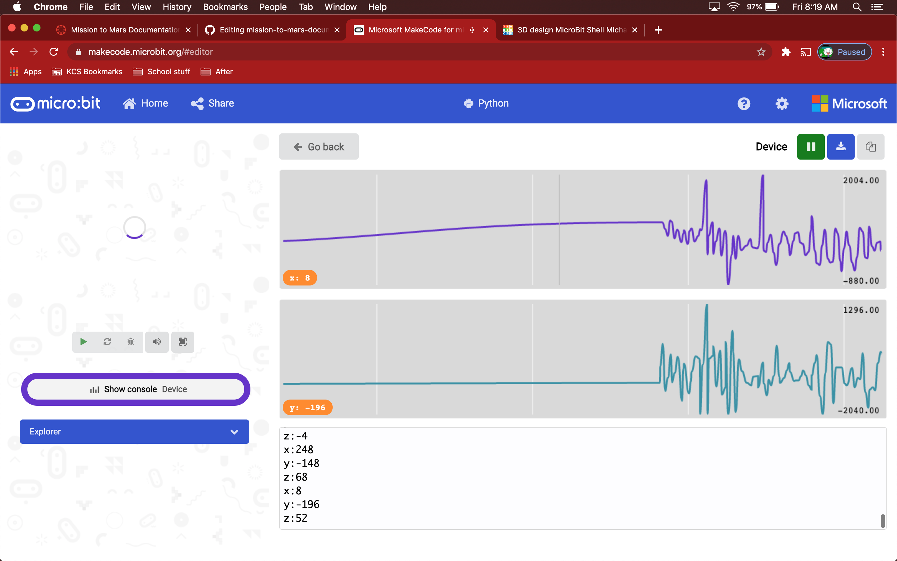
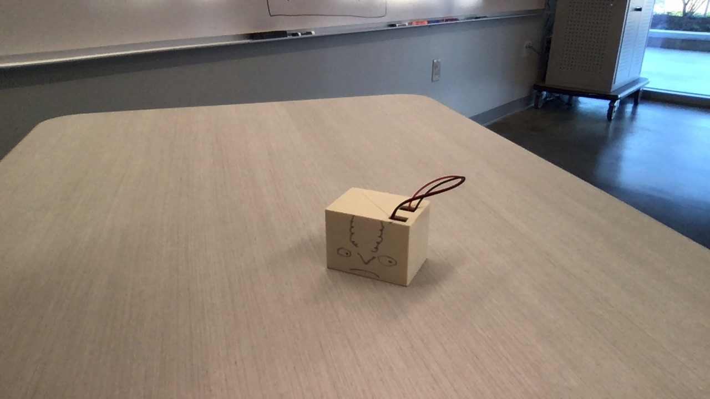
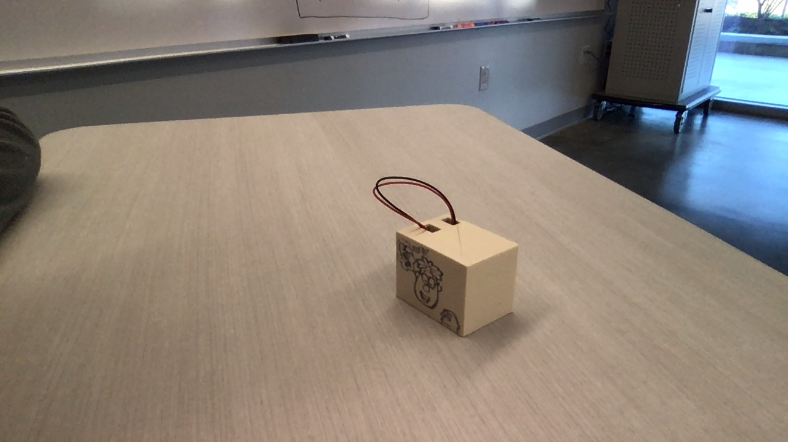
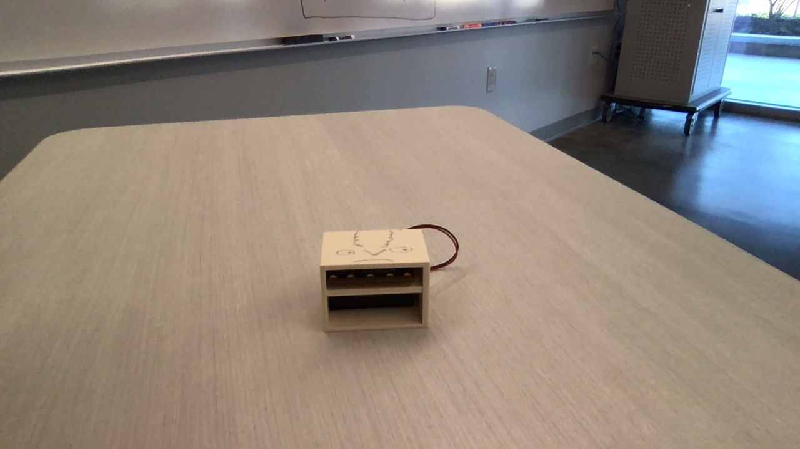
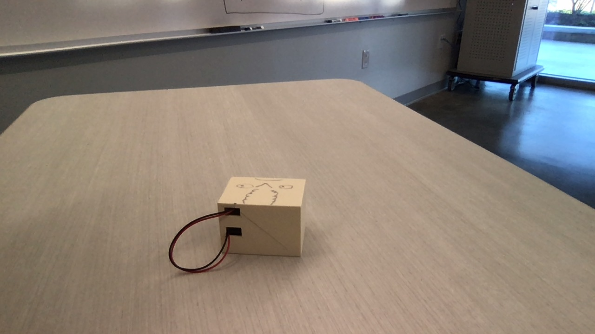
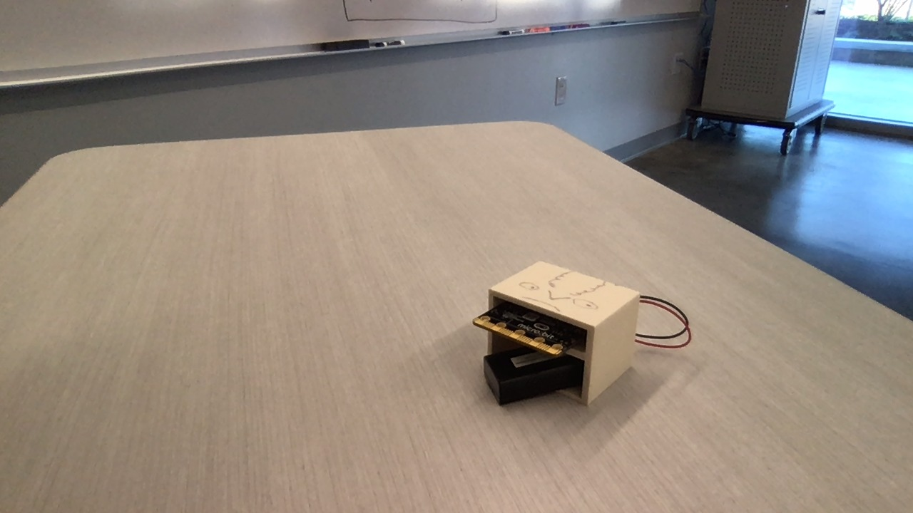

# Mission-to-Mars-Documentation
## Name Of Team Sensor Payload - M.O.R.G.E.
What Does M.O.R.G.E stand for? - Mechanical Organic Rotating Giroscopic Entity






Reciever Code:
```python
radio.set_group(99)
def on_received_value(name, value):
    serial.write_value(name, value)
radio.on_received_value(on_received_value)
```
Sender Code:
```python
radio.set_group(99)
def on_forever():
    radio.send_value("x", input.acceleration(Dimension.X))
    radio.send_value("y", input.acceleration(Dimension.Y))
    radio.send_value("z", input.acceleration(Dimension.Z))
    pause(50)
basic.forever(on_forever)
```
##
